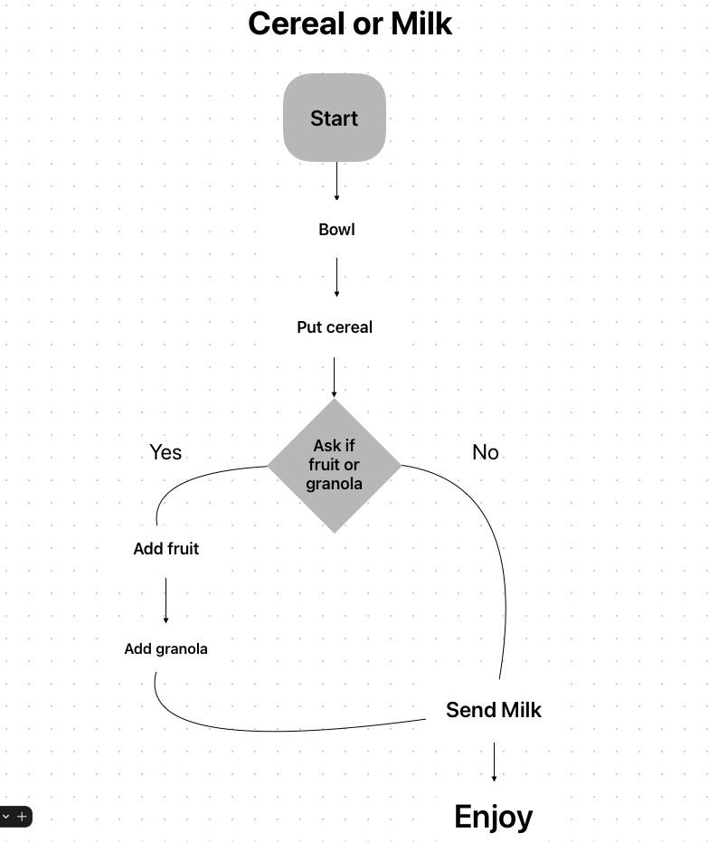

## Solution 

### Algorithm to prepare a cereal

1. Bowl
2. Put the Bowl in the desk
3. If want some fruit or granola:
	1. Ask for the fruit (strawberry, banana, apple, etc)
	2. add the select:
		1. add fruit
			or
		2. add some granola
4. Serve the milk
5. Enjoy

