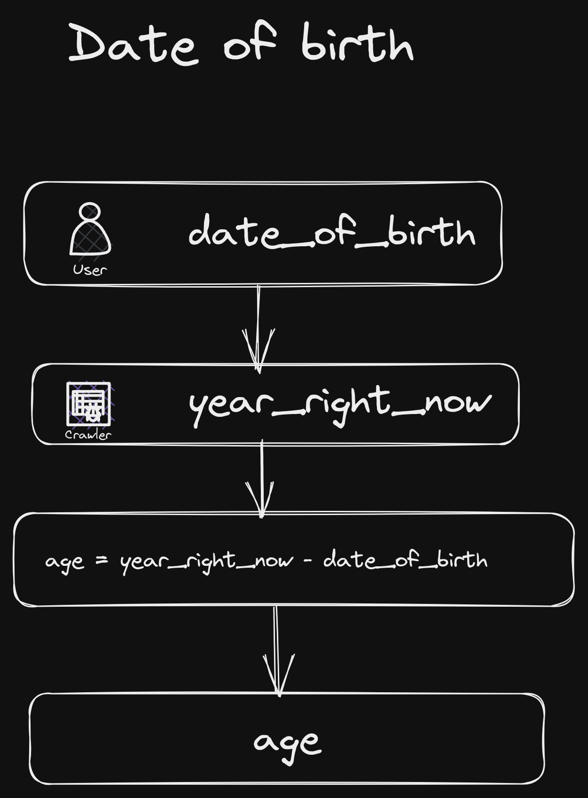

# How old are you

### Know your Age

1. Ask for the date of birth -> `date_of_birth`
2. Defines the current years -> `year_right_now`
3. Calculate age with mathematical operation "`Subtract`". We define a new variable. `age`.
4. We apply the operation `age = date_of_birth - right_now`
5. We call our variable
6. Print your age on the screen.

