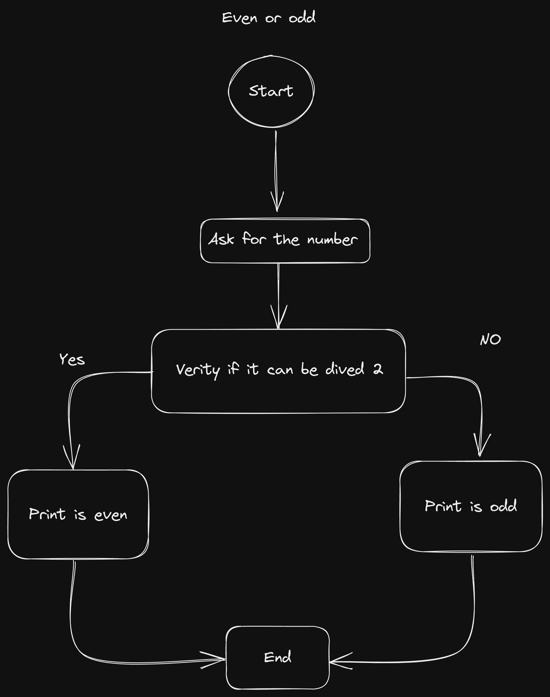

1. Ask for number, you need to verify the number is Par. Need two opcion: Yes or No.
2. Two options are needed
	1. `yes` -> Number is `par`
	2. `No` -> Number is `odd`
3. If the number is even, print "Even"
	1. Example: 2 / 2 = 1. When dividing, the result is an integer. Even number
4. The number is odd, it prints odd.
		Example: the number is not divisible by 2, so it is a float.

		
