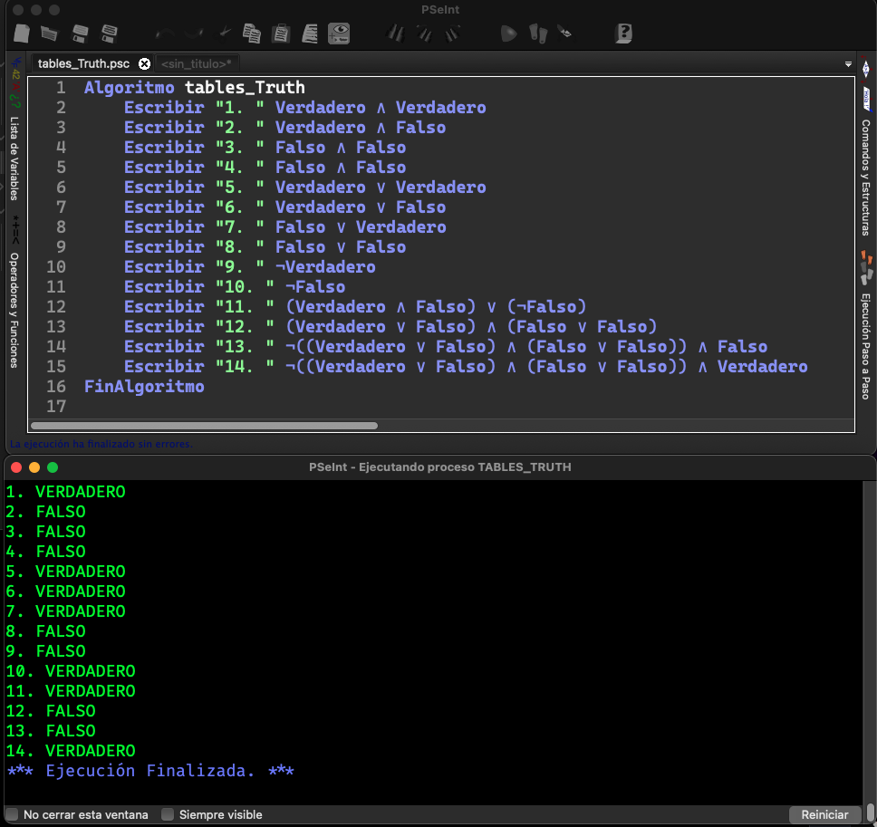
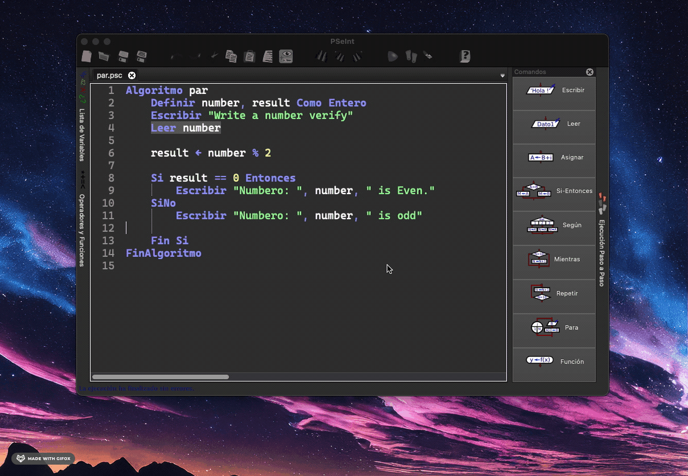

# Truth Table



## Truth Tables

1. T `&` T = T ✅
2. T `&` F = F ✅
3. F `&` T = T ⚔️
4. F `&` F = F ✅
5. T `|` T = T ✅
6. T `|` F = F ⚔️
7. F `|` T = T ✅
8. F `|` F = F ✅
9. `~`T = T ⚔️
10. `~`F = T ✅
11. (T `&` F) `|` (`~`F) = T ✅
12. (T `|` F ) `&` (F `|` F) = T ⚔️
13. `~`((T `|` F ) `&` (F `|` F)) `&` F = T ⚔️
14. `~`((T `|` F ) `&` (F `|` F)) `&` T = F ⚔️

# Boolean results

```pseudocode
Algoritmo boolean
	a <- 5 == 3
  // a = FALSO
  // Descrip: Se esta comparando si 5 es igual a 3, lo que da como resultado FALSO
	b <- 4 <> 3
  // a = VERDADERO
  // Descrip: Se esta comparando si 4 es diferente a 3, lo que da como resultado VERDADERO
	c <- 7 > 7
  // c = FALSO
  // Descrip: Se esta comparando si 7 es mayor a 7, lo que da como resultado FALSO
	d <- 4 < 4
  // d = FALSO
  // Descrip: Se esta comparando si 4 es menor a 4, lo que da como resultado FALSO
	e <- 100 <= 90
  // e = FALSO
  // Descrip: Se esta comparando si 100 es menor o igual a 90, lo que da como resultado FALSO
	f <- 40 >= 40
  // f = VERDADERO
  // Descrip: Se esta comparando si 40 es mayor o igual a 40, lo que da como resutlado VERDADERO
FinAlgoritmo
```

# Identify odd and even numbers


