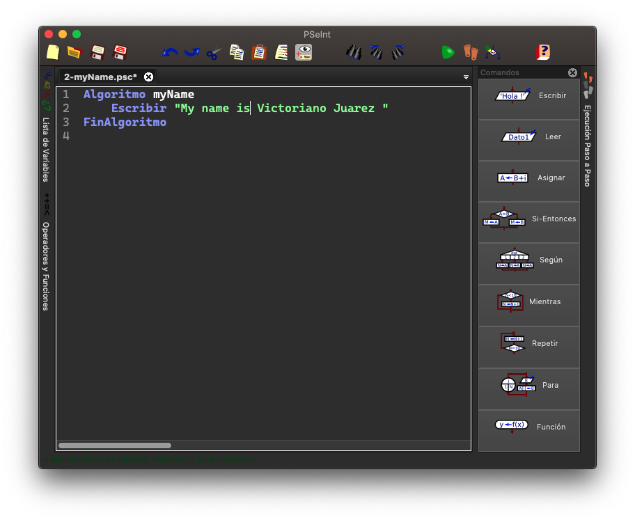
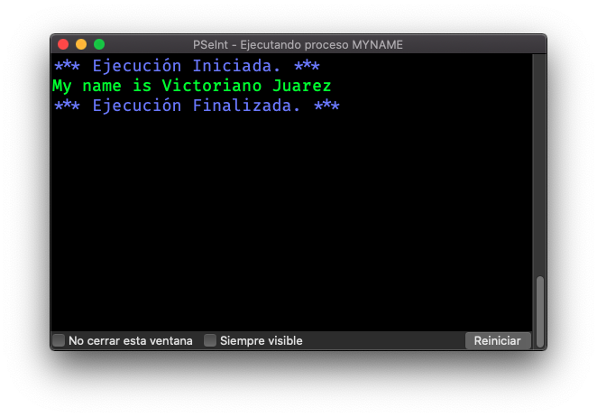
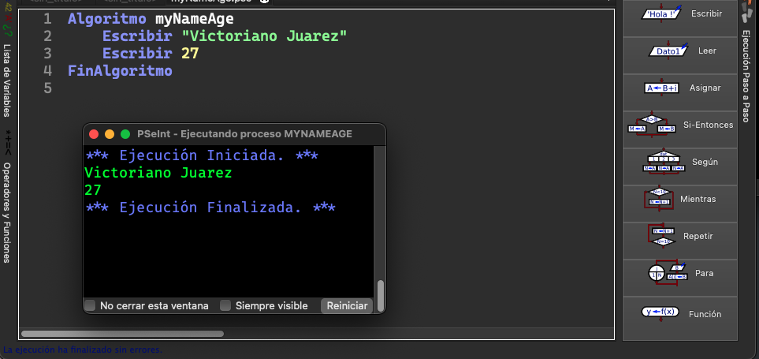

# Print my Name

## Pseint


`File myName`

```pseudocode
Algoritmo myName
	Escribir 'My name is Victor Juarez'
FinAlgoritmo
```

## Screensheet

### 1 - My name



#### My name in terminal 



### 2 - Print My name and Age




